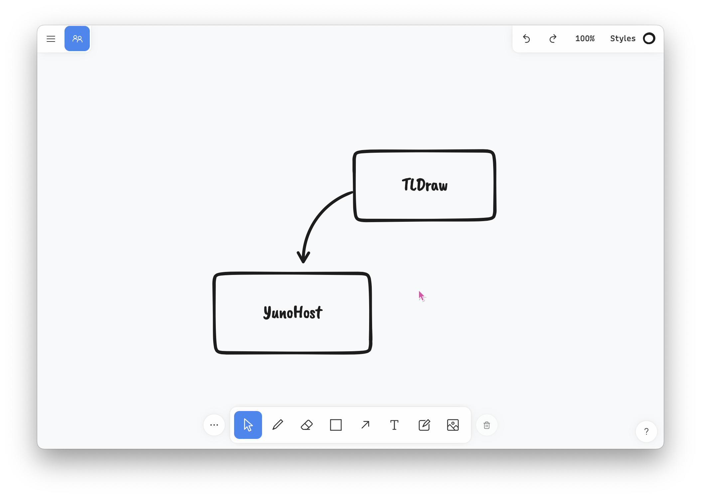

<!--
N.B.: This README was automatically generated by https://github.com/YunoHost/apps/tree/master/tools/README-generator
It shall NOT be edited by hand.
-->

# TLDraw pour YunoHost

[](https://dash.yunohost.org/appci/app/tldraw)    
[](https://install-app.yunohost.org/?app=tldraw)

*[Read this readme in english.](./README.md)*

> *Ce package vous permet d'installer TLDraw rapidement et simplement sur un serveur YunoHost.
Si vous n'avez pas YunoHost, regardez [ici](https://yunohost.org/#/install) pour savoir comment l'installer et en profiter.*

## Vue d'ensemble

TLDraw is a tiny little drawing app.

### Features

- Very clean and nice UX
- Snappy and very low memory footprint on the server
- PWA ready
- Multiplayer mode (iFrame compatible)


**Version incluse :** 1.24.5~ynh2


**Démo :** https://tldraw.com

## Captures d'écran



## Avertissements / informations importantes

* TLDraw can't be installed on a subpath, and needs a fully dedicated domain

* The multiplayer mode requires Liveblocks API keys (Public and Secret)
    * You can get some for free at liveblocks.io
    * Be **very careful** though, and keep in mind that by doing so, all your multiplayer rooms data will be stored on livestocks.io SaaS servers, and **NOT** on your server
    * Multiplayer mode is completely optional and you don't have to use it
    * If API keys are not provided, it will be automatically deactivated

* TLDraw will not take a lot of disk or memory space while running.
    * **However**, you will need at least 2.5GB of RAM and 5GB of disk space during installation time
    * The build can be quite long, be patient !

* TLDraw offers all functionnalities (including multiplayer) for free at tldraw.com
    * However, they have restricted the use of multiplayer mode within an iFrame, which could be a problem
    * TLDraw Yunohost app is patching that restriction so that you can use multiplayer mode within an iFrame as before

* It could be possible to self-host a multiplayer layer in the future. Some projects have been launched, based on YJS library, such as https://github.com/nimeshnayaju/yjs-tldraw, but sadly none of them is mature enough to be included here.
    * Obviously, as soon as multiplayer could be enabled without going through Liveblocks SaaS servers, the app will be updated accordingly
## Documentations et ressources

* Site officiel de l'app : <https://tldraw.com>
* Documentation officielle utilisateur : <https://github.com/tldraw/tldraw/blob/main/guides/documentation.md>
* Documentation officielle de l'admin : <https://github.com/tldraw/tldraw/blob/main/guides/documentation.md>
* Dépôt de code officiel de l'app : <https://github.com/tldraw/tldraw>
* Documentation YunoHost pour cette app : <https://yunohost.org/app_tldraw>
* Signaler un bug : <https://github.com/YunoHost-Apps/tldraw_ynh/issues>

## Informations pour les développeurs

Merci de faire vos pull request sur la [branche testing](https://github.com/YunoHost-Apps/tldraw_ynh/tree/testing).

Pour essayer la branche testing, procédez comme suit.

``` bash
sudo yunohost app install https://github.com/YunoHost-Apps/tldraw_ynh/tree/testing --debug
ou
sudo yunohost app upgrade tldraw -u https://github.com/YunoHost-Apps/tldraw_ynh/tree/testing --debug
```

**Plus d'infos sur le packaging d'applications :** <https://yunohost.org/packaging_apps>
