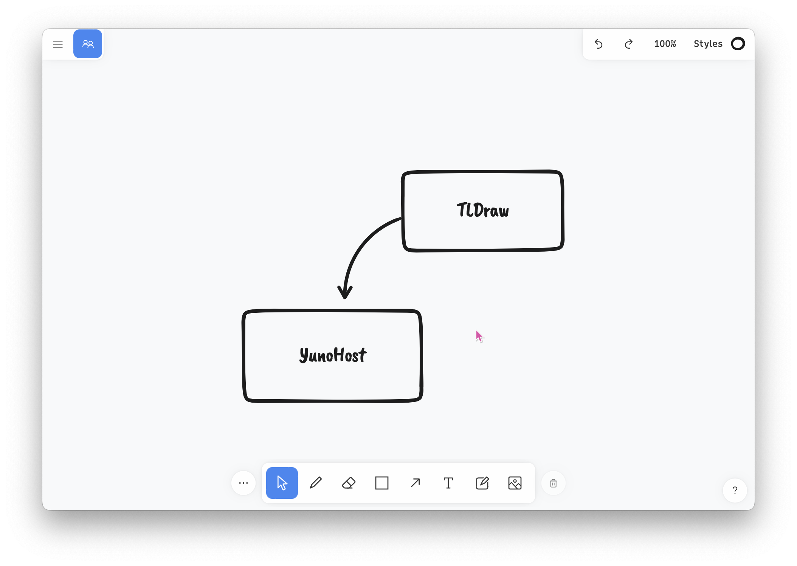

<!--
N.B.: README ini dibuat secara otomatis oleh <https://github.com/YunoHost/apps/tree/master/tools/readme_generator>
Ini TIDAK boleh diedit dengan tangan.
-->

# TLDraw untuk YunoHost

[](https://ci-apps.yunohost.org/ci/apps/tldraw/)


[](https://install-app.yunohost.org/?app=tldraw)

*[Baca README ini dengan bahasa yang lain.](./ALL_README.md)*

> *Paket ini memperbolehkan Anda untuk memasang TLDraw secara cepat dan mudah pada server YunoHost.*  
> *Bila Anda tidak mempunyai YunoHost, silakan berkonsultasi dengan [panduan](https://yunohost.org/install) untuk mempelajari bagaimana untuk memasangnya.*

## Ringkasan

TLDraw is a tiny little drawing app.

### Features

- Very clean and nice UX
- Snappy and very low memory footprint on the server
- PWA ready
- Multiplayer mode (iFrame compatible)


**Versi terkirim:** 1.24.5~ynh4

**Demo:** <https://tldraw.com>

## Tangkapan Layar



## Dokumentasi dan sumber daya

- Website aplikasi resmi: <https://tldraw.com>
- Depot kode aplikasi hulu: <https://github.com/tldraw/tldraw>
- Gudang YunoHost: <https://apps.yunohost.org/app/tldraw>
- Laporkan bug: <https://github.com/YunoHost-Apps/tldraw_ynh/issues>

## Info developer

Silakan kirim pull request ke [`testing` branch](https://github.com/YunoHost-Apps/tldraw_ynh/tree/testing).

Untuk mencoba branch `testing`, silakan dilanjutkan seperti:

```bash
sudo yunohost app install https://github.com/YunoHost-Apps/tldraw_ynh/tree/testing --debug
atau
sudo yunohost app upgrade tldraw -u https://github.com/YunoHost-Apps/tldraw_ynh/tree/testing --debug
```

**Info lebih lanjut mengenai pemaketan aplikasi:** <https://yunohost.org/packaging_apps>
